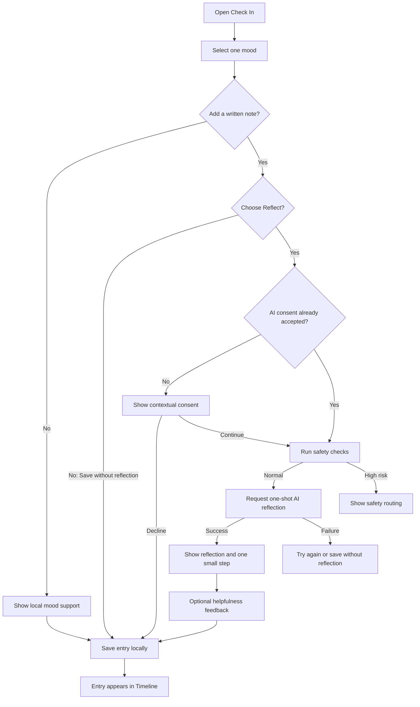

# Daily Better AI Emotional Journal Design

Date: 2026-06-30

## Product Decision

Daily Better will evolve from a general affirmation and mood-tracking app into a private AI emotional journal for everyday emotional fluctuations.

The product is for young adults who feel overwhelmed by work or study and want a short, low-friction way to express what is happening, receive a compassionate reflection, and identify one manageable next step.

The product promise is:

> Name what is happening. Put it into words if you want. Leave with one kinder perspective and one small next step.

Daily Better is not a medical device, diagnostic tool, therapy service, crisis service, or open-ended AI chatbot. It does not assess depression or anxiety risk, assign mental-health scores, recommend treatment, or claim to improve a clinical condition.

## Version 1.1 Scope

Version 1.1 includes:

- Multiple check-ins per day.
- One required mood selection per check-in.
- One optional plain-text note per check-in.
- A local-only response when the user submits a mood without text.
- A one-shot AI reflection when the user explicitly submits written text for reflection.
- A private on-device timeline with week navigation and chronological entries.
- Optional one-tap feedback: `A little` or `Not yet`.
- One optional daily local reminder at a user-selected time.
- First-use AI consent, per-entry AI control, privacy controls, export, and deletion.
- High-risk content routing that bypasses the normal reflection flow.

Version 1.1 excludes:

- Voice input or transcription.
- Weekly or monthly reports.
- Behavioral or emotional pattern analysis across entries.
- Charts, scores, diagnoses, or clinical assessments.
- Open-ended AI conversation or follow-up chat.
- User accounts, cloud sync, or cross-device history.
- Remote push notifications.
- A separate affirmation library, favorites, or custom affirmations.
- Theme selection and custom in-app text-size settings.

Reports, voice input, and cross-entry pattern analysis may be considered only after the core check-in and reflection loop has enough real usage data.

## Information Architecture

The app has two primary destinations:

1. `Check In`: starts a new emotional entry and optionally requests a reflection.
2. `Timeline`: reviews previous entries by date and time.

Settings is opened from a gear button in the upper-right corner. It is not a tab.

The existing `Mood`, `Library`, and `Settings` tabs are removed. Mood history becomes Timeline. The affirmation library, favorites, and custom affirmation UI are removed.

## Core User Flow

## Check In Screen

The screen must feel empty enough for the user to supply the content.

Visible elements, in order:

- Small app name, date, and Settings gear.
- The single prompt `How are you?`
- Six compact mood choices.
- The selected mood label.
- A large optional writing area with the placeholder `What's on your mind?`
- Primary action `Reflect`.
- Secondary action `Save without reflection`.
- Compact two-item navigation for Check In and Timeline.

The screen must not contain statistics, onboarding explanations, promotional cards, saved-count summaries, weekly mood counts, an affirmation card, or a custom-affirmation prompt.

### Mood Set

Version 1.1 uses six understandable everyday states:

- Anxious
- Overwhelmed
- Low
- Frustrated
- Drained
- Good

These labels are intended for everyday self-expression, not clinical classification. One mood is required so Timeline remains structured even when no note is added.

### Empty-Text Behavior

If the note is empty, `Reflect` does not send a network request. The app shows a short curated local response for the selected mood and saves the check-in locally.

If the note contains text, `Reflect` starts the consent, safety, and AI request flow. `Save without reflection` always stores the entry locally without transmitting text.

## AI Reflection Screen

The AI response is a structured one-shot reflection, not a chat response.

The screen contains:

- The selected mood and entry time.
- The user's note in visually secondary form.
- One concise emotional reflection.
- One kinder perspective embedded in the reflection.
- One concrete, low-risk small step.
- Primary action `Done`.
- Secondary action `Give me a different step`.
- Optional feedback `A little` or `Not yet`.

### Response Contract

The generated response must:

- Use two to four short sentences for the reflection.
- Use no more than 90 words before the small step.
- Provide one small step of no more than 35 words.
- Describe signals from the user's words without claiming certainty.
- Validate positive entries without inventing a problem to solve.
- Avoid diagnosis, treatment, medical advice, psychological scoring, dependency language, or claims of professional expertise.
- Avoid pretending to remember information that was not included in the current request.
- Avoid mentioning policy, model behavior, or system prompts.

`Give me a different step` may request one replacement action using the same entry and reflection context. It does not open a conversational thread.

## Timeline Screen

Timeline combines fast date navigation with an open, card-free chronological view.

The top of the screen contains:

- A seven-day week strip.
- Previous and next week controls.
- A clear selected date.
- A small marker under dates that contain entries.

The selected date displays a vertical time rail. Each entry shows:

- Time.
- Mood and emoji.
- User note, or a short indication that only a mood was recorded.
- The small-step summary when an AI or local reflection exists.

Tapping an entry opens its complete saved detail. Swiping or using arrows changes weeks. Tapping a date filters the timeline without navigating to a new screen.

No reports, charts, streaks, or aggregate scores appear in version 1.1.

## Navigation and Icon Standard

The bottom navigation is a compact two-item floating capsule.

- `Check In` uses a plus inside a circle.
- `Timeline` uses clock hands inside the same circle.

Both icons use the same outer geometry, optical size, rounded stroke weight, alignment frame, and label style. The selected destination uses one filled green capsule with white icon and text. The unselected destination stays neutral. Icons do not change weight or size between states.

## Visual System

The visual direction is minimal but not sterile.

- Background: low-contrast pale green layered gradient.
- Texture: subtle, evenly distributed grain visible only on close inspection.
- Main text: near-black green.
- Accent: muted deep green.
- Content surfaces: translucent white with low-contrast borders.
- Corner radii: consistent rounded geometry; large cards are avoided on the primary flow.
- Typography: system sans-serif for controls and structure; restrained serif treatment may be used for journal text and the main reflection.
- Motion: short crossfades and vertical reveals; no decorative looping animation.
- Accessibility: support Dynamic Type and VoiceOver through system behavior rather than a custom text-size setting.

The background and texture must never reduce text contrast or make the writing area appear pre-filled.

## Settings Screen

Settings uses a lightweight grouped list and includes only controls that change behavior or protect user trust.

### Daily Reminder

- Reminder toggle, default off.
- One user-selected daily time.
- Clear status that the reminder is scheduled locally on the device.
- If system permission is denied, the toggle remains off and the app offers `Open iOS Settings`.

### AI and Privacy

- `How reflections work`.
- `Storage & privacy`.
- A concise statement that only entries explicitly submitted through `Reflect` are sent for processing.

There is no global AI toggle. Per-entry `Reflect` and `Save without reflection` actions provide control without creating two persistent product modes.

### User Data

- Export Timeline.
- Delete All Entries with destructive confirmation.

### Support

- Safety Resources.
- Send Feedback.
- Privacy Policy.
- App version.

Settings does not include theme selection, custom text-size controls, an affirmation library, or promotional content.

## Notification Design

Version 1.1 uses one repeating local notification created with `UNCalendarNotificationTrigger`.

- Default: off.
- Frequency: once daily.
- Time: selected by the user.
- Content: a neutral prompt such as `Take a moment to check in.`
- Tap destination: Check In.
- Remote APNs, device tokens, and a notification server are not used.

Changing the reminder time replaces the pending local request. Turning the reminder off removes the pending request. The notification must not infer that the user is sad, anxious, or in need of help.

## Privacy and AI Data Flow

Daily Better uses a hybrid architecture:

- Entries and Timeline remain on-device.
- No account is required.
- No complete Timeline is sent to the AI service in version 1.1.
- A request includes only the current mood, current optional note, locale, and a request identifier.
- The app never contains a provider API secret.
- The app sends requests through a minimal backend proxy.
- The backend does not log journal text or AI response content.
- Operational logs are limited to request identifier, timestamp, model identifier, latency, token counts, and success or failure status.
- The AI provider must contractually prohibit training on submitted API data and support the shortest practical retention policy. The selected provider policy must be disclosed before release.
- The app privacy disclosure and privacy policy must be updated before App Store submission.

The first written reflection request presents contextual consent. Consent text identifies what is sent, why it is sent, that Timeline remains on-device, and where the user can read full privacy details.

## Safety Routing

Every written reflection request passes through safety checks before normal generation.

The safety design contains two layers:

1. On-device checks detect obvious high-risk language early enough to avoid showing a normal loading state.
2. Backend safety classification runs before generation and may override the normal reflection response.

If content indicates possible self-harm, suicide, abuse, or immediate physical danger:

- The normal affirmation and small-step response is not shown.
- The app states that it cannot provide crisis care.
- The app encourages contacting local emergency services, a trusted person, or an appropriate crisis resource.
- Region-appropriate safety resources are presented from a maintained resource catalog.
- The user controls whether the original entry is stored locally.
- No diagnosis or risk score is displayed.

Safety-resource links and emergency information must be verified before every release that modifies the catalog.

## Failure Handling

### Network or AI Failure

- Keep the unsaved entry visible.
- Show `Couldn't reflect right now`.
- Offer `Try again` and `Save without reflection`.
- Never replace a failed AI request with content presented as personalized AI output.

### Malformed AI Output

- Reject responses that fail schema validation or safety checks.
- Retry once through the backend with the same request identifier.
- If the retry fails, use the normal AI failure state.

### Notification Permission Denied

- Keep the in-app reminder disabled.
- Explain that permission is controlled by iOS.
- Offer a direct link to the app's system settings.

### Local Save Failure

- Do not dismiss the current entry.
- Show a concise retry message.
- Preserve the user's draft in memory until save succeeds or the user explicitly discards it.

## Data Model

The primary persisted model is `CheckInEntry`:

- `id: UUID`
- `createdAt: Date`
- `moodKey: String`
- `noteText: String?`
- `reflectionText: String?`
- `suggestedActionText: String?`
- `reflectionSource: local | ai | none`
- `reflectionStatus: none | pending | completed | failed | safetyRouted`
- `helpfulness: better | unchanged | unanswered`
- `safetyRouteShown: Bool`

Preferences store:

- Reminder enabled state.
- Reminder hour and minute.
- AI consent version and acceptance date.

The app does not persist an AI conversation thread because version 1.1 has no chat.

## Existing-User Migration

- Existing `MoodEntry` records migrate to `CheckInEntry` with the mapped mood, original date, and no note or reflection.
- New installs no longer seed or display built-in affirmations.
- Existing affirmation records are not deleted automatically in version 1.1, preventing destructive migration.
- Legacy custom affirmation text is included in user-data export until a later version explicitly removes the legacy store.
- Existing reminder preferences migrate to the new single reminder. If the previous reminder was enabled, the new reminder remains disabled until the user confirms a time and notification wording in the new Settings screen.

## Component Boundaries

The implementation should keep these responsibilities separate:

- `CheckInComposer`: mood selection, draft text, and action choice.
- `ReflectionService`: provider-independent reflection request contract.
- `SafetyRouter`: local pre-checks, backend safety result interpretation, and resource routing.
- `CheckInRepository`: local persistence and migration.
- `TimelineView`: week selection and chronological rendering.
- `ReminderScheduler`: one local notification and permission state.
- `PrivacyConsentStore`: versioned AI consent state.
- `ExportService`: user-readable export containing current and legacy user-created data.

Views must not call an AI provider directly or contain provider credentials.

## Validation and Testing

### Unit Tests

- Mood mapping from legacy entries.
- Empty-text local response path.
- Written-text AI request path.
- Per-entry save-without-reflection path.
- AI response schema validation and word limits.
- Safety routing precedence over normal reflection.
- Notification scheduling, replacement, and removal.
- Week navigation and date filtering.
- Export inclusion of current entries and legacy custom text.

### Integration Tests

- First reflection consent accepted and declined.
- Backend success, timeout, malformed response, moderation override, and server error.
- Draft preservation after failure.
- Timeline persistence across relaunch.
- Notification tap opens Check In.

### UI and Manual Tests

- Check In with mood only.
- Check In with mood and text.
- Positive, low, frustrated, anxious, drained, and overwhelmed examples.
- Multiple entries on one day and navigation across weeks.
- Dynamic Type, VoiceOver labels, reduced motion, and high-contrast checks.
- Offline behavior.
- Notification denied and later restored in iOS Settings.
- Delete and export confirmation flows.
- Safety resources on each supported storefront region.

## Product Success Measures

The experiment should separate acquisition from product value:

- Acquisition: App Store impressions, product-page views, conversion, and first-time downloads.
- Activation: percentage of installers who complete one Check In.
- Reflection adoption: percentage of written entries submitted through Reflect.
- Return behavior: users with a second Check In within seven days, using available App Store usage analytics.
- Response usefulness: ratio of `A little` to answered helpfulness prompts.
- Reliability: AI request success rate and median latency, without logging journal content.

Downloads remain an important acquisition measure, but interface quality cannot be evaluated from downloads alone. A successful redesign should improve both product-page conversion and completion of the core Check In loop.

## Release Strategy

Version 1.1 should be developed behind focused commits and reviewed through a pull request. Before App Store submission:

- Run migration tests against a copy of version 1.0 data.
- Complete TestFlight testing for AI, privacy, offline, notification, and safety flows.
- Update App Store screenshots and metadata to describe an AI emotional journal rather than an affirmation library.
- Update App Privacy disclosures and Privacy Policy for cloud AI processing.
- Add complete App Review notes explaining local storage, per-entry AI requests, safety routing, and the absence of medical diagnosis.
- Confirm the regulated medical-device declaration remains accurate for the final wording and functionality.
