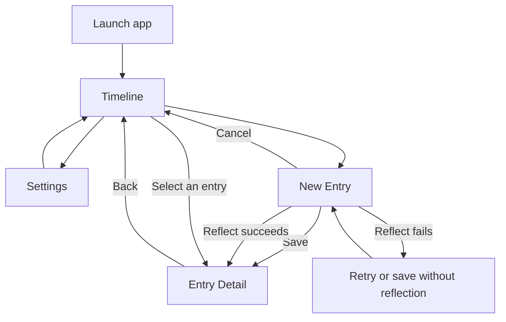

# Daily Better Timeline-First Journal Redesign

Date: 2026-07-20
Status: Approved design, pending implementation plan

## Product Decision

Daily Better will use Timeline as its single home screen. Recording a check-in becomes a focused creation flow opened from Timeline rather than a permanent tab.

The redesign keeps the existing product promise: help a user name a feeling, record what happened, and optionally receive one short, compassionate AI reflection. It removes navigation and copy that compete with that loop.

The intended experience is:

> Open to your recent story. Add what is happening now. Return with a saved record and, when requested, one helpful reflection.

This remains a private emotional journal for everyday use. It is not a medical device, diagnostic tool, therapy service, crisis service, or open-ended AI chatbot.

## Goals

- Make Timeline the clearest representation of the product's value.
- Give long-form writing enough space without hiding actions behind the keyboard.
- Support quick mood-only entries and richer text entries in the same flow.
- Add optional photo attachment and speech-to-text without changing the local-first privacy model.
- Preserve existing entries and their moods during the redesign.
- Make Save, Reflect, navigation, and failure recovery predictable.
- Reduce the root interface to one primary destination and one creation action.

## Non-Goals

This increment does not add:

- Reports, charts, scores, streaks, or cross-entry emotional analysis.
- A separate Check In tab or bottom tab bar.
- Recorded audio playback or audio-file storage.
- Image analysis or sending images to the AI provider.
- Cloud sync, accounts, or cross-device history.
- Open-ended AI chat or follow-up conversation.
- Entry sharing or public publishing.
- Affirmation favorites, custom affirmations, or an affirmation library.

Entry sharing may be evaluated later. It must not be exposed as an active control in this increment.

## Information Architecture

The app has one root destination:

1. `Timeline`: the home screen and history browser.

Secondary destinations are presented above Timeline:

- `New Entry`: a full-screen journal composer opened from the fixed `Check in` button.
- `Entry Detail`: a full-screen reading surface opened after saving or by selecting a Timeline entry.
- `Settings`: a secondary screen opened from the Timeline header.

No bottom tab bar is shown on Timeline, New Entry, Entry Detail, or Settings.

## Screen Design

### Timeline Home

Timeline is the first screen after launch.

It contains:

- A compact header with the product title and Settings button.
- Previous- and next-week controls.
- A seven-day week strip with a clearly selected date.
- A subtle marker on dates that contain entries.
- A vertical time rail for the selected date.
- Chronological entry summaries connected visually to the rail.
- A fixed, full-width `Check in` button above the bottom safe area.

Each Timeline summary shows:

- Entry time.
- Mood emoji and label.
- Up to three lines of note text when text exists.
- A neutral mood-only label when no note exists.
- A subtle indicator when an AI or local reflection exists.
- A small attachment indicator when photos exist; the full images remain in detail.

Reflection text and suggested actions are not rendered in the Timeline list. Long notes use a three-line limit and standard ellipsis so one entry cannot dominate the selected day.

The `Check in` button is a soft green gradient pill using SF Pro Semibold. It is the only persistent creation entry point.

### New Entry Composer

New Entry is a full-screen secondary page, not a sheet nested inside a tab.

The layout has three regions:

1. Fixed top bar.
2. Scrollable entry body.
3. Fixed bottom action dock above the keyboard and bottom safe area.

#### Fixed Top Bar

The top bar contains:

- A visible close or back action that returns to Timeline.
- The entry date and time, captured when the composer opens and used as the saved `createdAt` value.
- No Save or Reflect action, avoiding duplicated controls.

If the user has entered text, selected a mood, or attached a photo, leaving the page requires a discard confirmation. An untouched composer closes immediately.

#### Scrollable Entry Body

The body contains:

- Six balanced mood choices.
- A large text editor with the placeholder `What's on your mind?`.
- An `Add photo` action.
- A `Speak to text` action.
- Selected photo thumbnails with a remove action.

The body scrolls as a page while the action dock remains visible. The text editor must allow long input and must not force the Save or Reflect controls off-screen. When the keyboard appears, the selected text range and current editing position remain visible.

One mood is required before saving or reflecting. Text and photos are optional.

#### Fixed Bottom Action Dock

The action dock contains exactly two controls:

- `Save`: white surface, subtle green outline, SF Pro Semibold.
- `Reflect`: soft green gradient, white label, SF Pro Semibold.

The dock remains above the software keyboard and safe area. It does not scroll with journal content. There is no keyboard-toolbar `Done`, Save, or Reflect button.

`Save` stores the entry locally and opens Entry Detail.

`Reflect` uses the existing behavior boundary:

- Mood only: generate a local reflection without a network request.
- Mood plus text: request one remote AI reflection.
- Photos are never included in the reflection request.

While reflecting, the primary action displays progress and both actions prevent duplicate submission. The draft remains intact until a save succeeds.

### Entry Detail

Entry Detail is the complete reading surface for a saved entry.

It contains:

- A visible Back action that returns to Timeline.
- Entry date and time.
- Mood emoji and label.
- Full, untruncated note text.
- Attached photos in a compact adaptive layout.
- The complete reflection and suggested action when present.
- Existing helpfulness feedback when a reflection is present.
- An overflow menu for `Edit entry` and `Delete entry` only.

An entry saved without reflection does not show an empty reflection card. Entry sharing is not shown in this increment.

After Save or successful Reflect, the composer is replaced by Entry Detail. Back returns directly to Timeline and shows the newly saved entry on its date.

#### Editing an Existing Entry

`Edit entry` reopens the same composer with the saved mood, note, timestamp, and attachments populated.

- Editing preserves the original entry identifier and `createdAt` value.
- Saving changes updates the existing entry instead of creating a duplicate.
- If mood or note text changes, the existing reflection and suggested action are cleared because they no longer describe the saved input.
- The user may choose Reflect to generate a replacement reflection from the edited mood and text.
- Attachment-only changes preserve an existing reflection because images are not part of the AI request.
- Cancel leaves the saved entry unchanged and removes any temporary attachment files created during editing.

## Mood System

The redesign uses six everyday states that cover positive, neutral, and difficult experiences without implying diagnosis:

| Stable key | Label | Emoji | Visual tone |
| --- | --- | --- | --- |
| `bright` | Bright | `😊` | warm pale yellow |
| `calm` | Calm | `🙂` | pale mint |
| `okay` | Okay | `😐` | soft neutral gray |
| `anxious` | Anxious | `😰` | pale sky blue |
| `low` | Low | `😔` | muted lavender-gray |
| `overwhelmed` | Overwhelmed | `😣` | pale coral |

Mood controls use system emoji on pastel circular or softly rounded backgrounds. Labels remain visible; emoji alone is not sufficient for meaning or accessibility.

## Existing Data Migration

The shipped app already persists mood raw values. Replacing the enum without migration would mislabel historical entries, so the new mood system requires migration version 2.

Existing `CheckInEntry.moodKey` values map as follows:

| Existing value | New value |
| --- | --- |
| `good` | `bright` |
| `anxious` | `anxious` |
| `overwhelmed` | `overwhelmed` |
| `low` | `low` |
| `frustrated` | `overwhelmed` |
| `drained` | `low` |

Legacy `MoodEntry` values map as follows when they have not already been migrated:

| Legacy value | New value |
| --- | --- |
| `radiant` | `bright` |
| `steady` | `calm` |
| `neutral` | `okay` |
| `low` | `low` |
| `stressed` | `anxious` |
| `tired` | `low` |

Migration requirements:

- Run once through the existing versioned migration service.
- Be safe to call repeatedly without creating or remapping duplicate entries.
- Preserve entry identifiers, dates, notes, reflections, feedback, and legacy links.
- Never silently map an unknown stored value to a positive mood.
- Preserve unknown values for diagnostics and display them as `Okay` only at the presentation boundary until explicitly migrated.
- Include tests for every mapping and for repeated execution.

## Photo Attachments

Photo attachment uses the system Photos picker.

Data rules:

- A user may attach up to four images to one entry.
- The app copies selected images into its private application-support directory.
- SwiftData stores attachment identifiers, display order, dimensions, and local filenames, not large image blobs.
- Images are orientation-normalized, resized to a maximum 2048-pixel long edge, and encoded as JPEG at approximately 0.82 quality before persistence.
- Removing a draft attachment deletes its temporary copy.
- Deleting an entry deletes its associated local files.
- Export and Delete All Entries must include or remove attachments consistently.
- Images never leave the device and are never sent to the reflection backend in this version.

If photo permission or picker access is unavailable, text and mood entry continue to work normally.

## Speech-to-Text

`Speak to text` starts live transcription and inserts the resulting text into the note editor.

Privacy and behavior rules:

- Request microphone and speech-recognition permissions only when the user first invokes the feature.
- Show listening state, an explicit stop action, and partial transcript feedback.
- Append finalized text at the current insertion point rather than replacing existing writing.
- Do not persist an audio file or expose audio playback.
- Stop recognition when the user stops it, leaves the composer, backgrounds the app, or starts saving.
- If permission is denied or restricted, explain the limitation and offer `Open iOS Settings`; manual typing remains available.
- Place speech framework access behind a protocol so permission, partial transcript, completion, cancellation, and error states can be tested.

The privacy policy and App Store privacy disclosures must be checked before release to reflect speech processing behavior on supported OS versions.

## Save and Reflection Data Flow

### Save

1. Validate that a mood is selected.
2. Normalize optional note text.
3. Finalize local photo files.
4. Insert the entry and attachment metadata in one logical save operation.
5. If persistence fails, keep the full draft and show a retryable error.
6. On success, open Entry Detail.

### Reflect

1. Validate that a mood is selected.
2. Normalize optional note text.
3. Do not upload photos.
4. Use local reflection for mood-only input or the existing backend path for written input.
5. On success, persist the entry, attachments, reflection, and suggested action, then open Entry Detail.
6. On failure, preserve mood, text, insertion position, and attachments.
7. Offer `Try again`, `Save without reflection`, and `Cancel`.

No entry is automatically saved after a failed reflection request. `Save without reflection` remains an explicit user choice.

## Visual System

The approved direction is `Soft Expressive`.

- Background: very pale mint-to-cream gradient with a barely visible dot or paper texture.
- Primary actions: soft deep-green gradient with restrained depth, not glossy effects.
- Secondary actions: white or translucent-white surface with a subtle green border.
- Typography: SF Pro; action labels use SF Pro Semibold.
- Journal body: system typography with generous line height and Dynamic Type support.
- Mood controls: system color emoji on coordinated pastel surfaces.
- Main text: near-black green with high contrast.
- Corners: consistent, generous radii without turning every content block into a heavy card.
- Motion: short page transitions, button progress, and gentle insertion feedback only.

The texture must never interfere with legibility or make the writing area look pre-filled.

## Accessibility

- Support Dynamic Type without clipping the fixed action dock.
- Expose mood emoji and label as one VoiceOver control, including selected state.
- Give close, back, photo, speech, Save, Reflect, edit, and delete controls explicit accessibility labels.
- Meet platform contrast guidance in normal, selected, disabled, and progress states.
- Do not communicate reflection availability or mood only through color.
- Respect Reduce Motion.
- Keep minimum interactive target size at 44 by 44 points.
- Ensure keyboard focus does not cover the insertion point or action dock.

## Delivery Strategy

Implementation should be delivered in three independently testable milestones:

### Milestone 1: Navigation and Core Composer

- Timeline-only root navigation.
- Fixed Timeline Check In action.
- Full-screen scrollable composer and fixed action dock.
- New six-mood system with migration.
- Save and Reflect transitions to Entry Detail.
- Updated detail navigation and long-text behavior.

### Milestone 2: Photo Attachments

- Photos picker.
- Local attachment persistence and cleanup.
- Composer thumbnails and detail gallery.
- Export and delete integration.

### Milestone 3: Speech-to-Text

- Permission flow.
- Live transcription service and UI state.
- Transcript insertion and cancellation behavior.
- Privacy disclosure verification.

Each milestone must pass its tests and Simulator acceptance checks before beginning the next. The milestones may ship together, but they should not be implemented as one unreviewable change.

## Acceptance Criteria

The redesign is complete when:

- Launching the app opens Timeline with no root tab bar.
- Timeline has one fixed Check In action and Settings remains reachable.
- Check In opens a full-screen composer with a visible exit action.
- Long text can be entered and scrolled while Save and Reflect remain visible above the keyboard.
- The composer contains no redundant keyboard-toolbar `Done`, Save, or Reflect action.
- All six approved moods are selectable and accessible by label.
- Every existing stored mood is migrated according to the documented mapping without losing entry data.
- Save opens the complete saved detail and Back returns to Timeline.
- Successful local and remote reflection both open the saved detail.
- Reflection failure preserves the full draft and supports retry or save without reflection.
- Timeline notes are limited to three lines while detail shows the complete note.
- Up to four local photos can be attached, removed, viewed, exported, and deleted without being sent to AI.
- Speech input produces editable text and leaves no retained audio file.
- Settings, composer, and detail never display the removed tab bar.
- VoiceOver, Dynamic Type, Reduce Motion, and keyboard avoidance checks pass on supported iPhone sizes.

## Release Safeguards

- Preserve the existing backend API contract; this redesign must not require a new provider secret in the app.
- Verify migration using a store seeded with current production mood values before distributing a build.
- Test upgrade installation over a production-like version, not only a clean install.
- Confirm privacy policy, App Store privacy answers, microphone usage text, and speech-recognition usage text before submission.
- Keep the implementation behind focused commits and a reviewable pull request so each milestone can be reverted independently.
